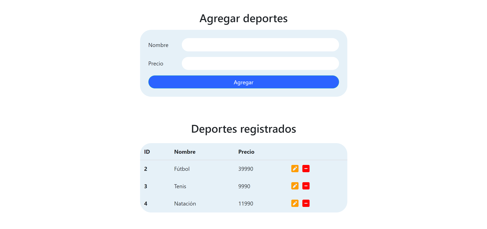
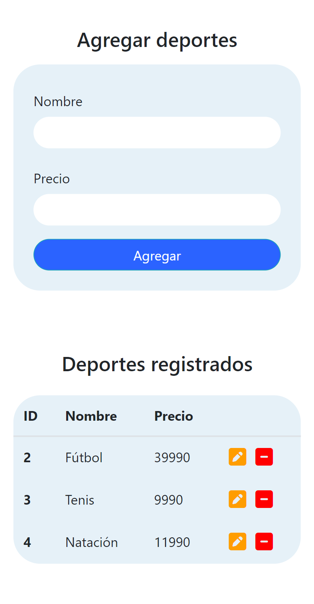

# Prueba - Club deportivo

En esta prueba se validan los conocimientos de desarrollo de sistemas CRUD y persistencia de datos en archivos JSON.

## Screenshots

## Requerimientos

1. Crear una ruta que reciba el nombre y precio de un nuevo deporte, lo persista en un archivo JSON.

2. Crear una ruta que al consultarse devuelva en formato JSON todos los deportes registrados.

3. Crear una ruta que edite el precio de un deporte registrado utilizando los parámetros de la consulta y persista este cambio.

4. Crear una ruta que elimine un deporte solicitado desde el cliente y persista este cambio.

## Dependencias Usadas

- Express
- Nodemon

## Instalación y Uso

- Descarga el repositorio.
- Instala las dependencias usando `npm install express nodemon`.
- Ejecuta el servidor con npm run dev. 